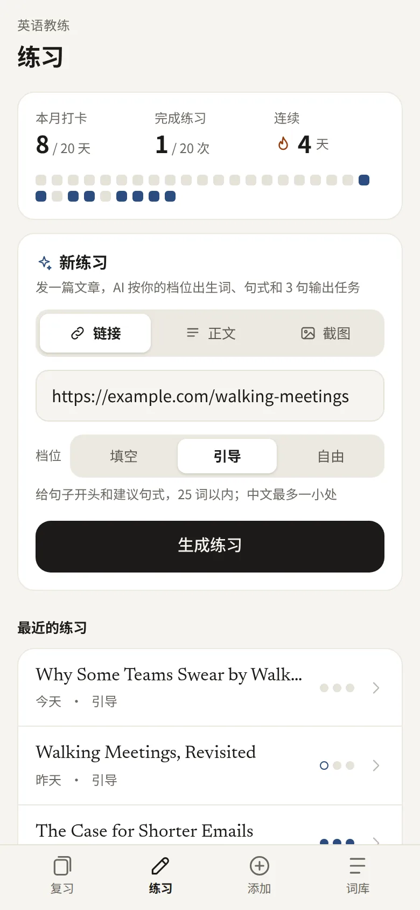
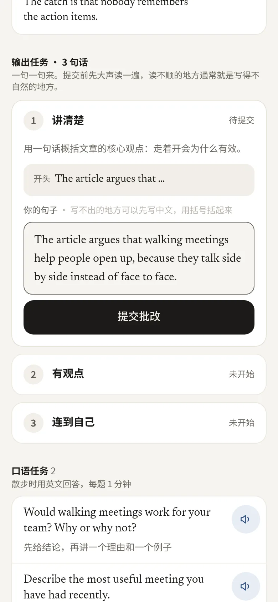
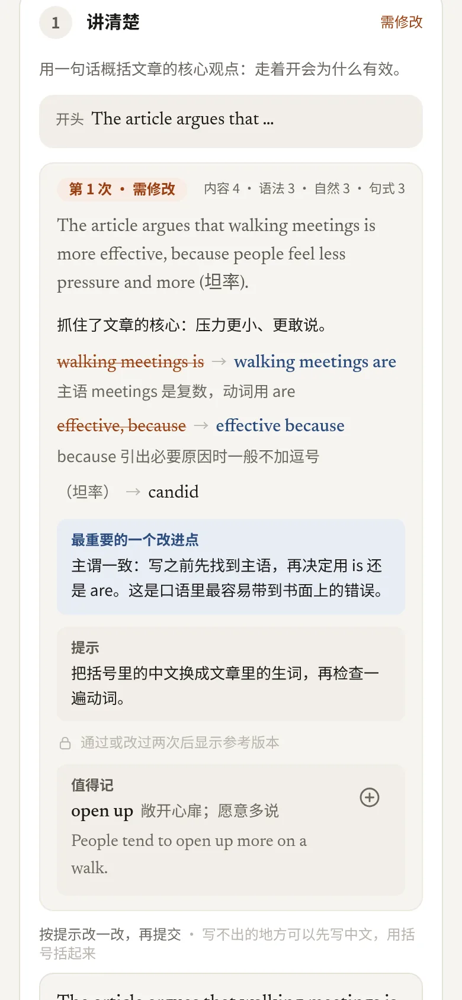
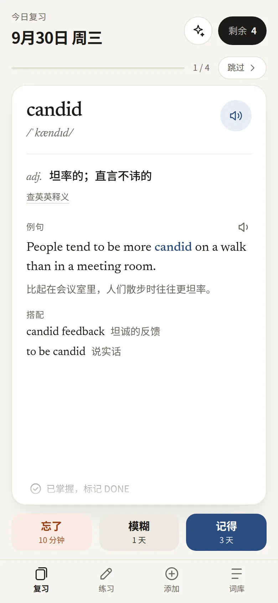
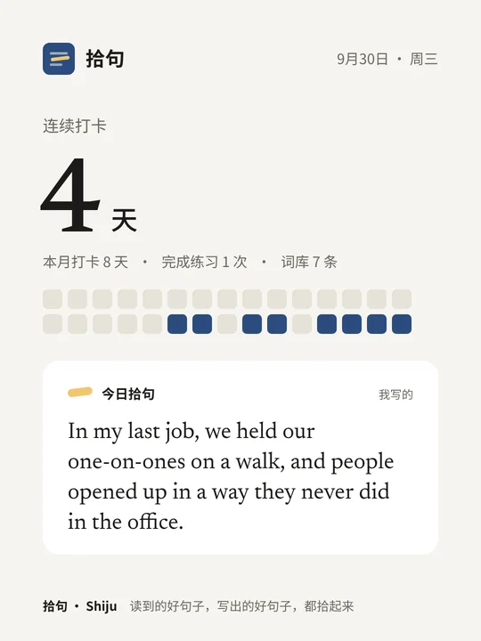
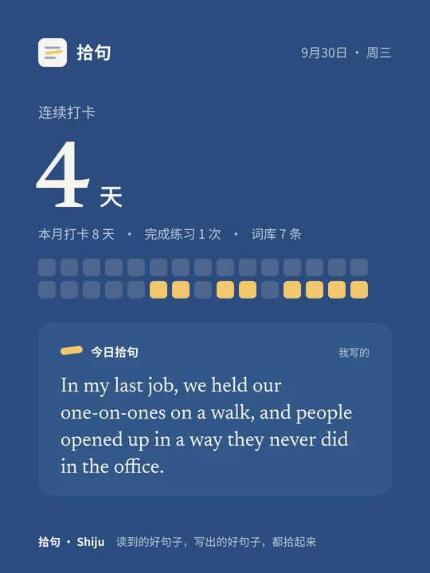

# 拾句 · Shiju

**读到的好句子，写出的好句子，都拾起来。** 一个自部署的英语学习小站：读一篇文章，写三句话，AI 逐句批改，值得记的表达变成复习卡片，按遗忘曲线复习。跑在你自己的 Cloudflare 账号上，数据和 AI key 都在自己手里。

<p align="center">
  <picture>
    <source media="(prefers-color-scheme: dark)" srcset="docs/images/flow-dark.svg">
    
  </picture>
</p>

| 1 发一篇文章 | 2 写三句话 | 3 AI 逐句批改 | 4 加入复习 |
|:---:|:---:|:---:|:---:|
| <picture><source media="(prefers-color-scheme: dark)" srcset="docs/images/1-article-dark.webp"></picture> | <picture><source media="(prefers-color-scheme: dark)" srcset="docs/images/2-write-dark.webp"></picture> | <picture><source media="(prefers-color-scheme: dark)" srcset="docs/images/3-feedback-dark.webp"></picture> | <picture><source media="(prefers-color-scheme: dark)" srcset="docs/images/4-review-dark.webp"></picture> |

<p align="center">
  
  &nbsp;
  
  <br><sub>打卡后一键生成分享卡片，可系统分享或保存到相册</sub>
</p>

> 截图和动画都用虚构的演示数据生成（`scripts/demo/`）。目前没有公开的在线 Demo：AI 调用走部署者自己的 Gemini key，公开出去额度会被刷光。想试用请[自己部署一份](docs/self-hosting.md)，大约 30 分钟。

## 功能

**练习（AI 写作教练）**：把「读文章 → 输出 → 批改」做成固定流程。

1. **新练习**：发链接、粘贴正文或上传截图。AI 按档位生成：难度判断、一句话概要、最多 5 个生词、2–3 个实用句式、3 句输出任务（讲清楚 / 有观点 / 连到自己）、口语题。
2. **逐句批改**：只改真正的错误，每次只说一个最重要的改进点，先给提示；通过或改过两次后才显示参考版本；4 项评分。
3. **一键加入复习**：生词、句式、批改里「值得记」的表达，点 ⊕ 就变成复习卡片。
4. **打卡**：本月打卡天数、完成练习数、连续天数，完成后可以生成分享卡片。

三个档位：**入门·填空**（给填空模板，15 词内，可写中文括号）/ **进阶·引导**（给句子开头，25 词内）/ **挑战·自由**（只给目标，至少用 1 个当天的句式）。设置页的「教练设定」可以写你的背景和目标，出题和批改都会参考。

**复习卡片**
- 输入单词或句子，AI 补全音标、释义、例句和搭配。英英释义取自词典原文，AI 只负责挑出和语境对应的义项。
- 两种复习方式：认读（看英文想意思）和产出（看中文情境，说出空里的英文），可混合。
- AI 重组：用到期的词造新句子，连续播放。
- 每个词句都能听 Gemini 的自然语音，听过的会缓存，断网也能播。

**其他**：手机和电脑自适应，可以装到主屏幕（PWA），跟随系统深色模式；支持小范围多人使用，每人数据隔离、各有 AI 额度；自带每日调用上限，防止账单失控。

电脑端快捷键：`空格` 翻转 · `1/2/3` 评分 · `P` 播放 · `D` 标记 DONE。

## 部署

👉 **[自部署指南](docs/self-hosting.md)**：fork → 创建 Cloudflare 资源 → 填 GitHub Secrets → 初始化部署 → 配置 Access 登录 → 正式部署。

需要：GitHub 账号、Cloudflare 账号（免费版即可）、Gemini API key。Merriam-Webster 词典 key 可选。

部署工作流会先检查配置：缺少必填项会直接报错并告诉你缺什么。还没配置登录时按「初始化部署」发布，这时接口拒绝一切请求，不会读取数据，也不会调用 AI。

## 架构

```
浏览器 ──► Cloudflare Access（只放行名单里的邮箱）
            │
            ▼
        Worker（Hono）
        ├── 静态页面：React + Vite + Tailwind（dist/）
        ├── /api/*  ── 再校验一次 Access JWT
        ├── D1  ── 词条、复习进度、练习与批改
        ├── R2  ── 语音缓存（同一句只生成一次）
        └── Gemini API（key 只存在 Worker Secret 里，前端拿不到）
```

目录：`src/` 前端，`worker/` 后端，`shared/` 两端共用的类型和复习算法，`migrations/` 数据库结构，`scripts/demo/` 演示数据与 README 截图生成脚本。

## 多用户（小范围分享）

- **谁能进**：Cloudflare Access 的放行名单（邮箱验证码登录，Zero Trust 免费版最多 50 人）。
- **数据隔离**：词库、复习进度、练习和用量都按登录邮箱隔离；语音缓存全站共用。
- **管理员**：GitHub Secret `ADMIN_EMAILS`（逗号分隔）。管理员可以改模型和音色、管理语音缓存、查看各成员费用。
- **额度**：成员每人每天 `USER_DAILY_TEXT_LIMIT` 次 AI 调用、`USER_DAILY_TTS_LIMIT` 段新语音，全站还受 `DAILY_*` 总上限约束。云端语音不可用时，自动改用系统朗读。

## 本地开发

```bash
cp .dev.vars.example .dev.vars   # 填入 GEMINI_API_KEY；AUTH_DISABLED=true 会跳过 Access 校验
npm install
npm run db:migrate:local
npm run build                    # wrangler dev 需要 dist/ 存在
npm run dev:api                  # 终端 1：Worker + 本地 D1/R2，端口 8787
npm run dev                      # 终端 2：Vite 前端，/api 自动转发到 8787
# 测多用户：.dev.vars 里设 ADMIN_EMAILS / DEV_USER，请求头 x-dev-user 可临时切换身份
```

重新生成 README 截图：见 `scripts/demo/` 里各脚本开头的说明（演示数据写进独立的本地数据库 `.demo/`，不影响开发数据）。

## 可调的配置

`wrangler.jsonc` 的 `vars`：

| 变量 | 默认 | 说明 |
|---|---|---|
| `GEMINI_TEXT_MODEL` | `gemini-3.8-flash` | 补全和造句用的模型 |
| `GEMINI_TTS_MODEL` | `gemini-3.8-flash-tts` | 语音模型，以 AI Studio 当前可用列表为准 |
| `GEMINI_VOICE` | `Kore` | 音色，可换 `Puck`、`Charon`、`Aoede` 等 |
| `GEMINI_BASE_URL` | Google 官方地址 | 想走 Cloudflare AI Gateway 时填网关地址 |

**英英释义**：查询顺序是 Merriam-Webster 学习者词典（`MW_LEARNERS_KEY`）→ Merriam-Webster 大学词典（`MW_COLLEGIATE_KEY`）→ [Free Dictionary API](https://dictionaryapi.dev/)（Wiktionary 数据，不需要 key）。Merriam-Webster 是**可选依赖**：免费 key 只限非商业使用、每天 1000 次；不配置时自动使用 Free Dictionary API。按其[品牌规范](https://dictionaryapi.com/info/branding-guidelines)，应用内展示官方标志并使用产品全称；标志在 CI 构建时下载，不随仓库分发。

**执行区域**：`wrangler.jsonc` 的 `placement.region` 是请求路由设置，让 Worker 在美国执行、调用 Gemini 的请求从美国发出，避免 `User location is not supported`。它不是任何地区的合规方案，详见[自部署指南](docs/self-hosting.md#关于执行区域)。

## 复习规则

极简版间隔重复（`shared/srs.ts`）：

- **忘了**：10 分钟后再出现（本轮会排到队尾再来一次），间隔重置为 1 天
- **模糊**：间隔 × 1.2，首次 1 天
- **记得**：间隔 × 2.5，首次 3 天
- **DONE**：不再参与复习和 AI 重组；在词库的 DONE 页可以随时恢复

## 接口

| 方法 | 路径 | 说明 |
|---|---|---|
| GET | `/api/stats` | 进行中 / DONE / 今日到期 数量 |
| GET | `/api/items?status=active\|done&q=` | 词库列表 |
| POST | `/api/items` | 保存 |
| PATCH | `/api/items/:id` | 修改、标记 DONE / 恢复 |
| DELETE | `/api/items/:id` | 删除 |
| GET | `/api/review` | 今日到期列表 |
| POST | `/api/review/:id` | `{grade: 0\|1\|2}` |
| POST | `/api/enrich` | `{text}` → AI 补全预览（不保存） |
| POST | `/api/remix` | `{exclude?: id[]}` → 用待复习词造 3 句 |
| GET | `/api/tts?text=&slow=1` | 先查 R2 缓存，没有再调 Gemini |
| GET | `/api/practice/stats` | 本月打卡统计 |
| GET | `/api/practice/share` | 分享卡片数据（打卡统计 + 今天可展示的句子） |

## 许可证

代码以 [MIT](LICENSE) 发布。词典释义、AI 生成内容和字体各自遵循原提供方的条款，见 [THIRD_PARTY.md](THIRD_PARTY.md)。
